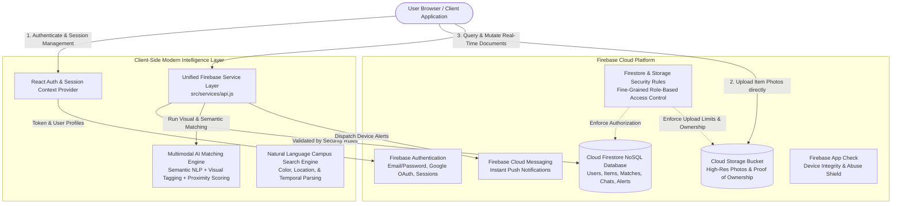

# Firebase 100% Serverless Architecture & Data Flow

This project is architected as a **100% Serverless Web Application** powered entirely by the **Firebase Platform** (Firebase Authentication, Cloud Firestore, Cloud Storage, and Firebase Cloud Messaging) with zero external backend or server requirements.

---

## 1. System Architecture Diagram



---

## 2. Core Service Roles in Serverless Mode

| Service | Technology | Role |
| :--- | :--- | :--- |
| **Identity & Authentication** | Firebase Authentication | Email/password sign-in, Google OAuth popup, automated email verification, password resets. |
| **Primary Database** | Cloud Firestore | Real-time NoSQL document store housing all 10 collections (`users`, `lostItems`, `foundItems`, `matches`, `verificationRequests`, `conversations`, `messages`, `notifications`, `auditLogs`, `reports`). |
| **Media & File Storage** | Cloud Storage | High-speed photo uploads with progressive compression and fallback data URLs. |
| **Push Alerts** | Firebase Cloud Messaging | Device registration and push notification dispatch to student and finder mobile devices. |
| **Security & RBAC** | `firestore.rules` & `storage.rules` | Enforces ownership and participant rules (`request.auth.uid == userId`, participants in conversation, role-based admin rules). |
| **Multimodal AI Matcher** | `src/services/aiMatcher.js` | Client-side semantic weighting algorithm evaluating category, brand, color, serial numbers, locations, dates, and visual tags. |

---

## 3. End-to-End User Data Flows

### A. Lost User Reporting Flow
1. User authenticates via Firebase Auth.
2. User selects an image; [`uploadImage()`](file:///c:/Users/LENOVO/Music/AI-BASED%20SMART%20CAMPUS%20LOST%20&%20FOUND%20SYSTEM/frontend/src/services/api.js) validates and uploads it directly to Cloud Storage.
3. Report metadata is saved to Firestore `/lostItems/{itemId}` with server timestamps.
4. The client-side AI engine instantly computes similarity across active found items in Firestore.
5. Potential matches ($\ge 70\%$ confidence) trigger in-app notifications in Firestore `/notifications`.

### B. Secure Verification & Real-Time Private Conversation Flow
1. Claimant submits a verification claim (`/verificationRequests/{requestId}`).
2. An associated private chat thread is provisioned in `/conversations/{conversationId}` with participants `[lostUserUid, foundUserUid]`.
3. Messages are synchronized in real-time via Firestore listeners (`/messages/{messageId}`).
4. Status transitions automatically update from `DELIVERED` to `SEEN` when opened.

### C. Single-Use QR Handover Flow
1. Once identity or OTP verification completes, a secure handover token is generated.
2. The finder verifies the handover token at the campus security desk.
3. Item statuses update directly in Firestore to `RECOVERED` / `RETURNED`.

---

## 4. Running the Application

Because the project is 100% serverless, no Python, Django, MongoDB, or FastAPI server is needed:

```powershell
cd frontend
npm install
npm run dev
```

The frontend connects directly to your live Firebase project: `ai-based-lost-and-found-system`.
